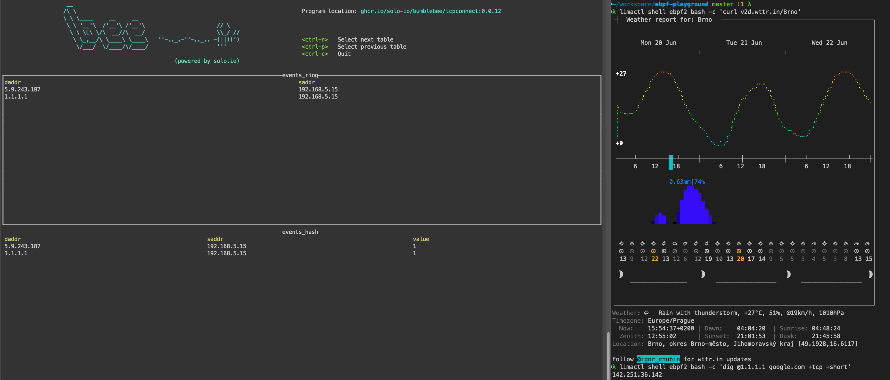

# hello eBPF (on Mac)

## start a linux vm (Alpine by default)

```bash
colima start -p ebpf
```

## Install Bumblebee
```bash
colima -p ebpf ssh -- sudo apk add curl python3
colima -p ebpf ssh -- ./install-bee.sh
colima -p ebpf ssh -- sh -c 'echo "export PATH=$HOME/.bumblebee/bin:$PATH" > ~/.profile'

# optional step in case corporate proxy intercepts the https
colima ssh -pebpf -- sudo sh -c "openssl s_client -showcerts -connect pkg-containers.githubusercontent.com:443 </dev/null 2>/dev/null|openssl x509 -outform PEM > /usr/local/share/ca-certificates/gh.crt && update-ca-certificates && cat /var/run/docker.pid | xargs kill"
```

```bash
colima -p ebpf ssh -- sh -c 'sudo env "PATH=$PATH" bee run ghcr.io/solo-io/bumblebee/tcpconnect:$(bee version)'
```
## Make net traffic

```bash
colima -p ebpf ssh -- curl v2d.wttr.in/Brno
```

This call was not caught because the Linux VM doesn't have the BTF enabled.
https://nakryiko.com/posts/bpf-portability-and-co-re/

Alpine [lacks support](https://gitlab.alpinelinux.org/alpine/aports/-/issues/13761) for BTF related tools so let's use some other distro that is [supported](https://github.com/aquasecurity/btfhub/blob/main/docs/supported-distros.md).

```bash
colima stop -p ebpf 
## optionally
colima delete ebpf
colima start -p ebpf2 
```


```bash
# ubuntu image
limactl start --name=ebpf2 template://docker --tty=false

cat <<EOF | limactl shell ebpf2 bash
    sudo -i

    # add ca-certs (proxy)
    openssl s_client -showcerts -connect pkg-containers.githubusercontent.com:443 </dev/null 2>/dev/null|openssl x509 -outform PEM > /usr/local/share/ca-certificates/gh.crt
    openssl s_client -showcerts -connect apt.llvm.org:443 </dev/null 2>/dev/null|openssl x509 -outform PEM > /usr/local/share/ca-certificates/apt-llvm.crt
    update-ca-certificates && systemctl restart containerd
    echo >>/etc/apt/apt.conf.d/99verify-peer.conf "Acquire { https::Verify-Peer false }"

    # install llvm (source: https://github.com/solo-io/bumblebee/blob/main/Vagrantfile#L11)
    export DEBIAN_FRONTEND=noninteractive
    export LLVM_VERSION=13
    curl -skL https://apt.llvm.org/llvm.sh "\$LLVM_VERSION" | bash
    apt-get -qq update

    # bpf related deps:
    apt-get -qq install linux-headers-\$(uname -r) linux-tools-\$(uname -r) libbpf-dev

    # dev tools:
    apt-get -qq install -y golang make

    # add headers:
    bpftool btf dump file /sys/kernel/btf/vmlinux format c > /usr/local/include/vmlinux.h
    curl -skLo /usr/local/include/solo_types.h https://raw.githubusercontent.com/solo-io/bumblebee/main/builder/solo_types.h
EOF
```

```bash
limactl shell ebpf2 bash -c "sudo apt-get -y install python"
limactl shell ebpf2 bash -- ./install-bee.sh
limactl shell ebpf2 bash -c 'echo "export PATH=$HOME/.bumblebee/bin:$PATH" > ~/.profile'
```

```bash
limactl shell ebpf2 bash -c 'sudo env "PATH=$PATH" bee run ghcr.io/solo-io/bumblebee/tcpconnect:$(bee version)'
```


```bash
limactl shell ebpf2 bash -c 'curl v2d.wttr.in/Brno'
limactl shell ebpf2 bash -c 'dig @1.1.1.1 google.com +tcp +short'

# this will fly under the radar (udp)
limactl shell ebpf2 bash -c 'dig @8.8.4.4 google.com +short'
```

## profit!



```bash
limactl delete ebpf2 -f
```